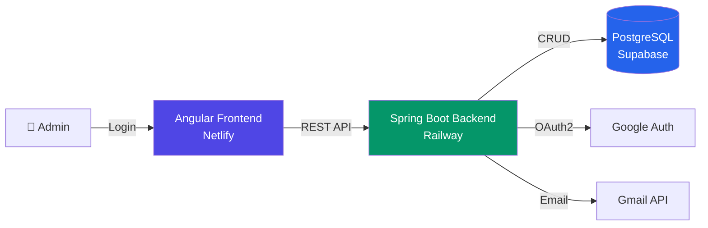
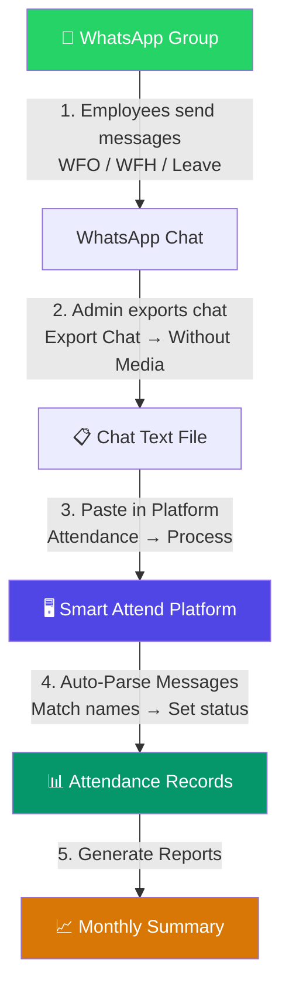
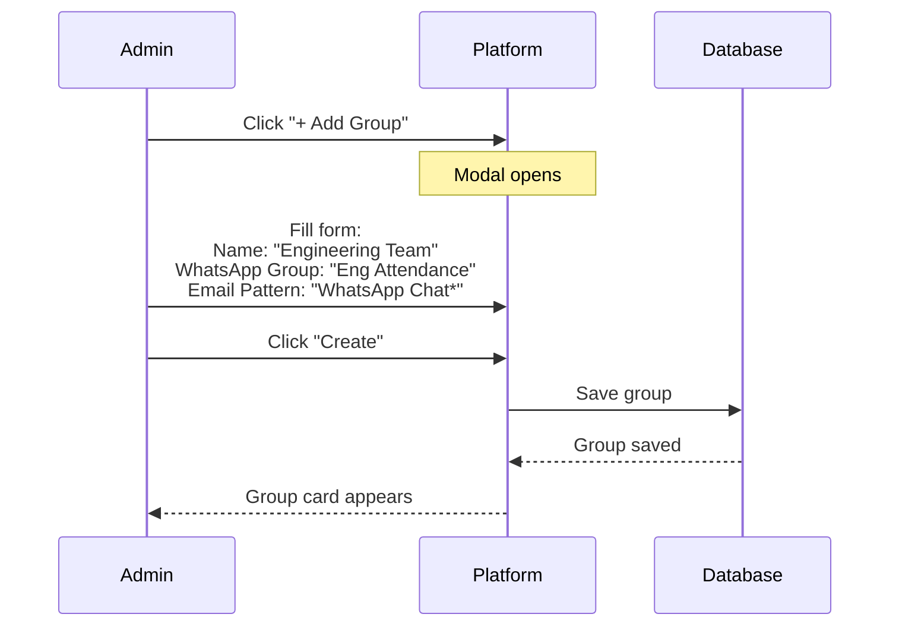
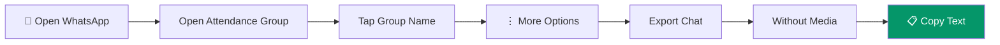
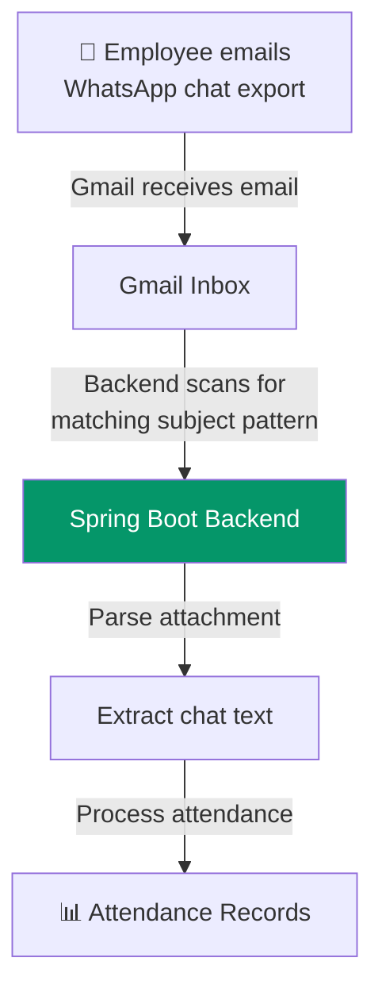
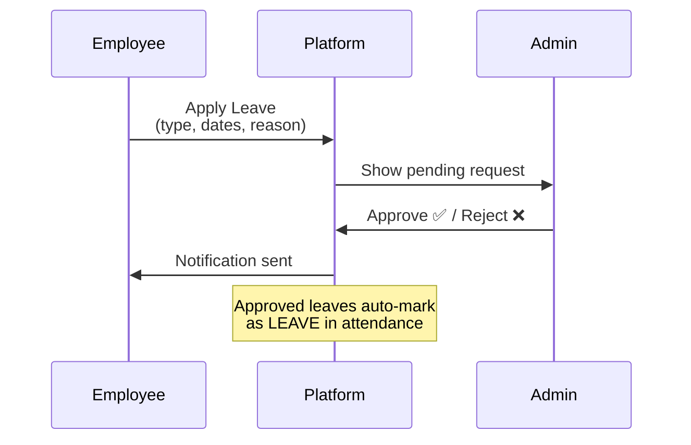
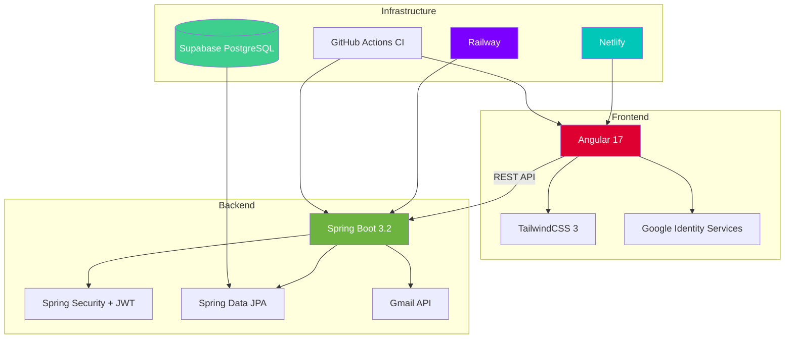

# 🎯 Smart Attendance Automation Platform - Complete Demo Guide

> **Live URLs**
> - 🌐 **Frontend**: [https://smart-attendance-automation.netlify.app](https://smart-attendance-automation.netlify.app)
> - ⚙️ **Backend API**: [https://smart-attendance-platform-production.up.railway.app](https://smart-attendance-platform-production.up.railway.app)

---

## 📐 Architecture Overview



---

## 🔄 How the Attendance Model Works



---

## 🗺️ App Navigation Map

```
┌──────────────────────────────────────────────────┐
│  SmartAttend                                      │
├──────────┬───────────────────────────────────────┤
│          │                                        │
│ SIDEBAR  │         MAIN CONTENT AREA              │
│          │                                        │
│ 📊 Dashboard  │  ← Stats + Charts               │
│ 📋 Attendance │  ← Daily records + Process Chat  │
│ 👥 Employees  │  ← Add/Edit employees            │
│ 🏢 Groups     │  ← WhatsApp group config         │
│ 🏖️ Leaves     │  ← Leave requests                │
│ 📅 Holidays   │  ← Holiday calendar              │
│ 📈 Summary    │  ← Monthly reports               │
│ ⚙️ Settings   │  ← Theme + Account               │
│          │                                        │
└──────────┴───────────────────────────────────────┘
```

---

## 🚀 Step-by-Step Demo

---

### ① Login with Google OAuth

```
Navigate to: https://smart-attendance-automation.netlify.app
```

```
┌─────────────────────────────────────┐
│                                     │
│         ┌──────────┐                │
│         │ 📋 ✓     │  ← Logo       │
│         └──────────┘                │
│                                     │
│         SmartAttend                  │
│   Automated Attendance Management   │
│                                     │
│   ✅ WhatsApp-based tracking        │
│   📊 Monthly reports & analytics    │
│   📧 Email notifications            │
│                                     │
│   ┌─────────────────────────┐       │
│   │ 🔵 Sign in with Google  │       │
│   └─────────────────────────┘       │
│                                     │
└─────────────────────────────────────┘
```

- Click **"Sign in with Google"**
- Select `sakthiveltony@gmail.com` → You get **ADMIN** role
- Redirected to **Dashboard**

---

### ② Dashboard Overview

```
Navigate: Sidebar → 📊 Dashboard
```

```
┌────────────────────────────────────────────────────┐
│  📊 Dashboard                                       │
├────────────┬───────────┬───────────┬───────────────┤
│ Total      │ Present   │ On Leave  │ Attendance    │
│ Employees  │ Today     │ Today     │ Rate          │
│    25      │    22     │     2     │    92%        │
├────────────┴───────────┴───────────┴───────────────┤
│                                                     │
│  📊 Weekly Attendance Chart                         │
│  ██████████████████ Mon: 24                         │
│  █████████████████  Tue: 23                         │
│  ████████████████   Wed: 22                         │
│  ██████████████████ Thu: 24                         │
│  ███████████████    Fri: 21                         │
│                                                     │
└─────────────────────────────────────────────────────┘
```

Shows real-time stats: employee counts, attendance rate, and bar chart.

---

### ③ Add a Group (WhatsApp Group Configuration)

```
Navigate: Sidebar → 🏢 Groups → Click "+ Add Group" button
```



**Form Fields:**

| Field | Example | Purpose |
|-------|---------|---------|
| **Name** *(required)* | `Engineering Team` | Display name |
| **WhatsApp Group Name** | `Eng Team Attendance` | Exact name in WhatsApp |
| **Email Subject Pattern** | `WhatsApp Chat*` | For email auto-processing |
| **Google Sheet ID** | *(optional)* | Google Sheets export |

**Result: Group Card**
```
┌─────────────────────────────┐
│  🟢 E  Engineering Team     │
│        5 employees    Active │
│                              │
│  💬 Eng Team Attendance      │
│  📧 WhatsApp Chat*           │
│                              │
│  [ Edit ]    [ Delete ]      │
└──────────────────────────────┘
```

---

### ④ Add Employees

```
Navigate: Sidebar → 👥 Employees → Click "+ Add Employee" button
```

**Form Fields:**

| Field | Example | Why It Matters |
|-------|---------|----------------|
| **Name** | `John Doe` | Display name |
| **Employee Code** | `EMP001` | Unique ID |
| **Email** | `john@company.com` | Notifications |
| **Phone** | `+91 98765 43210` | Contact |
| **Group** | `Engineering Team` | Assignment |
| **WhatsApp Name** | `John Doe` | ⚠️ **Must match WhatsApp display name exactly!** |

> ⚠️ **Critical**: The **WhatsApp Name** field must **exactly match** the employee's display name in the WhatsApp group. Otherwise, the attendance parser won't match their messages.

---

### ⑤ Export WhatsApp Group Chat & Process Attendance

This is the **core feature** of the entire platform.

#### Step A: Export Chat from WhatsApp



**Exported chat text looks like:**
```
17/02/2026, 09:00 - Alice Johnson: Good morning! WFO
17/02/2026, 09:05 - Bob Smith: WFH today
17/02/2026, 09:10 - Charlie Brown: On leave - fever
17/02/2026, 09:15 - Diana Prince: WFO
17/02/2026, 09:20 - Eve Wilson: WFH
17/02/2026, 17:30 - Alice Johnson: Out for the day
17/02/2026, 18:00 - Diana Prince: Out
```

#### Step B: Paste & Process in Platform

```
Navigate: Sidebar → 📋 Attendance → Click "Process" button (top-right)
```

```
┌─────────────────────────────────────────┐
│  Process WhatsApp Chat                   │
│                                          │
│  Date: [ 2026-02-17        📅 ]         │
│                                          │
│  Chat Text:                              │
│  ┌─────────────────────────────────────┐ │
│  │ 17/02/2026, 09:00 - Alice: WFO     │ │
│  │ 17/02/2026, 09:05 - Bob: WFH       │ │
│  │ 17/02/2026, 09:10 - Charlie: Leave │ │
│  │ 17/02/2026, 09:15 - Diana: WFO     │ │
│  │ 17/02/2026, 17:30 - Alice: Out     │ │
│  │ 17/02/2026, 18:00 - Diana: Out     │ │
│  └─────────────────────────────────────┘ │
│                                          │
│              [ Cancel ]  [ Process ]     │
└──────────────────────────────────────────┘
```

#### Step C: View Results

After processing, the attendance table auto-populates:

```
┌──────────────┬──────────┬─────────┬──────────┬─────────┬──────────┐
│ Employee     │ Code     │ In Time │ Out Time │ Status  │ Source   │
├──────────────┼──────────┼─────────┼──────────┼─────────┼──────────┤
│ Alice Johnson│ EMP001   │ 09:00   │ 17:30    │ 🟢 WFO  │ WHATSAPP │
│ Bob Smith    │ EMP002   │ 09:05   │ —        │ 🔵 WFH  │ WHATSAPP │
│ Charlie Brown│ EMP003   │ 09:10   │ —        │ 🟡 LEAVE│ WHATSAPP │
│ Diana Prince │ EMP004   │ 09:15   │ 18:00    │ 🟢 WFO  │ WHATSAPP │
│ Eve Wilson   │ EMP005   │ 09:20   │ —        │ 🔵 WFH  │ WHATSAPP │
│ Frank Miller │ EMP006   │ —       │ —        │ 🔴 ABSENT│ SYSTEM  │
└──────────────┴──────────┴─────────┴──────────┴─────────┴──────────┘
```

**Filter tabs:** `All (6)` | `WFO (2)` | `WFH (2)` | `Leave (1)` | `Absent (1)`

**Supported Keywords:**

| Message Keyword | Attendance Status |
|----------------|-------------------|
| `WFO` | 🟢 Work From Office |
| `WFH` | 🔵 Work From Home |
| `Leave`, `CL`, `SL`, `PL` | 🟡 Leave |
| `Out`, `leaving` | Sets out-time |

---

### ⑥ Email Integration

```
Navigate: Sidebar → 🏢 Groups → Set "Email Subject Pattern"
```



**How it works:**
1. Configure **Email Subject Pattern** in Group settings (e.g., `"WhatsApp Chat*"`)
2. When someone emails the exported WhatsApp chat, Gmail receives it
3. Backend periodically scans Gmail for emails matching the pattern
4. Automatically extracts and processes the chat text
5. Attendance records are created without any manual intervention

> **Required Railway Environment Variables:**
> `MAIL_HOST`, `MAIL_USERNAME`, `MAIL_PASSWORD`, `GMAIL_CREDENTIALS_PATH`

---

### ⑦ Leave Management

```
Navigate: Sidebar → 🏖️ Leaves
```



**Admin can:**
- View all pending leave requests
- **Approve** with remarks
- **Reject** with reason
- Approved leaves automatically update attendance records

---

### ⑧ Holiday Management

```
Navigate: Sidebar → 📅 Holidays → Click "+ Add Holiday"
```

| Field | Example |
|-------|---------|
| **Name** | `Republic Day` |
| **Date** | `2026-01-26` |

On holiday dates, **all employees** are automatically marked as `HOLIDAY` — no action needed.

---

### ⑨ Monthly Summary & Reports

```
Navigate: Sidebar → 📈 Summary → Select Month/Year → Click "Generate"
```

```
┌──────────────┬──────────┬─────┬─────┬───────┬────────┬────────────┐
│ Employee     │ Working  │ WFO │ WFH │ Leave │ Absent │ Attendance │
│              │ Days     │     │     │       │        │ Rate       │
├──────────────┼──────────┼─────┼─────┼───────┼────────┼────────────┤
│ Alice Johnson│ 22       │ 18  │ 3   │ 1     │ 0      │ 100%       │
│ Bob Smith    │ 22       │ 5   │ 15  │ 1     │ 1      │ 95.5%      │
│ Charlie Brown│ 22       │ 16  │ 2   │ 3     │ 1      │ 95.5%      │
│ Diana Prince │ 22       │ 20  │ 1   │ 1     │ 0      │ 100%       │
└──────────────┴──────────┴─────┴─────┴───────┴────────┴────────────┘
```

---

### ⑩ Settings

```
Navigate: Sidebar → ⚙️ Settings
```

- **🌙 Dark Mode**: Toggle between light and dark themes
- **👤 Account**: View your name, email, role (ADMIN/USER), and avatar
- **ℹ️ About**: App version and tech stack info
- **🚪 Sign Out**: Logout button

---

## 🔐 Role-Based Access Control

| Feature | 👑 ADMIN | 👤 USER |
|---------|----------|---------|
| View Dashboard | ✅ | ✅ |
| View Attendance | ✅ | ✅ |
| **Process WhatsApp Chat** | ✅ | ❌ |
| **Add/Edit Employees** | ✅ | ❌ |
| **Add/Edit Groups** | ✅ | ❌ |
| **Manage Holidays** | ✅ | ❌ |
| **Approve/Reject Leaves** | ✅ | ❌ |
| **Generate Summary** | ✅ | ❌ |
| View Settings | ✅ | ✅ |

---

## 🏗️ Tech Stack



---

## 📱 WhatsApp Chat Format Reference

The platform expects the standard WhatsApp export format:

```
DD/MM/YYYY, HH:MM - DisplayName: Message
```

### Example
```
17/02/2026, 09:00 - Alice: Good morning! WFO
17/02/2026, 09:05 - Bob: WFH today
17/02/2026, 09:10 - Charlie: On leave - fever
17/02/2026, 09:15 - Diana: WFO
17/02/2026, 17:30 - Alice: Out for the day
17/02/2026, 18:00 - Diana: Out
```

---

*Built with ❤️ using Angular 17, Spring Boot 3.2, PostgreSQL (Supabase), deployed on Netlify + Railway*
